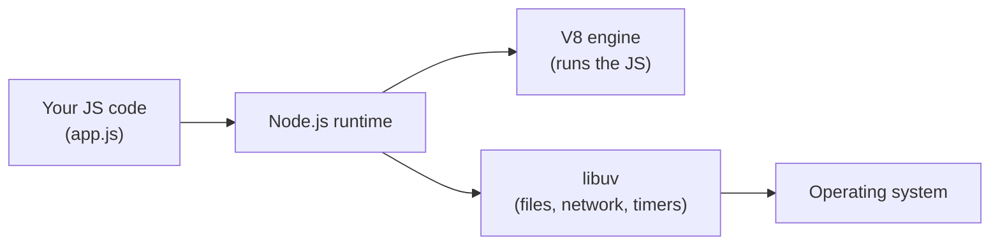

# 01 - What is Node.js?

## The one-sentence answer

**Node.js is a runtime that lets you run JavaScript outside the browser** - on a
server, on your laptop, anywhere. The same language you used for the front end
now runs on the back end, so it can read files, talk to databases, and answer
HTTP requests.

That is the whole idea. Everything else (npm, Express, the event loop) exists to
make server-side JavaScript fast and practical.

## Why Node.js exists: the problem it solves

For most of the web's history, JavaScript only ran **inside the browser**. If you
wanted server code (the program that listens for requests and sends back HTML or
data) you wrote it in PHP, Python, Java, Ruby - a different language from your
front end.

In 2009 Ryan Dahl took **V8**, the fast JavaScript engine Google built for
Chrome, and wrapped it so it could run on its own. He added the things a server
needs that a browser deliberately withholds: reading and writing files, opening
network sockets, listening on a port. The result was **Node.js**: JavaScript with
server superpowers.

The payoff is **one language across the stack**. The mental model you built doing
React - functions, objects, arrays, `async`/`await`, modules - is exactly the
model you use on the server.

## The runtime, the engine, and you



- **V8** is the engine that actually executes your JavaScript (turns it into
  machine code and runs it). The browser uses it too.
- **Node** wraps V8 and adds the built-in modules a server needs: `fs` (files),
  `http` (web server), `path`, `process`, `os`, and more. These are the APIs the
  browser does *not* give you.
- **`process`** is your program's handle on the outside world: `process.env`
  (environment variables), `process.argv` (command-line arguments),
  `process.exit()`.

## The event loop: non-blocking I/O

This is the single most important idea about *how* Node works, and a favorite
exam question.

Node runs your JavaScript on **one main thread** (one thing at a time). That
sounds slow for a server that must handle hundreds of users. The trick is that
Node **never sits and waits**. When your code asks for something slow - read a
file, query a database, fetch a URL - Node hands that job off, keeps running
other code, and comes back to your callback when the result is ready. This is
**non-blocking I/O**, coordinated by the **event loop**.

```js
import { readFile } from 'node:fs/promises'

console.log('1: start')
const data = await readFile('big.txt', 'utf8') // slow, but does NOT freeze Node
console.log('2: file is ready')
```

Compare the two models:

| | Blocking (naive) | Non-blocking (Node) |
| --- | --- | --- |
| While waiting for the disk | the whole program freezes | Node serves other requests |
| Threads needed for 100 users | ~100 | 1 (plus a background pool) |
| Good at | heavy CPU math | many small I/O jobs at once |

Because most server work is **I/O-bound** (waiting on databases, files, other
APIs, not crunching numbers), this model lets a single Node process handle a lot
of traffic cheaply. The flip side: a long **CPU-heavy** loop *does* block the one
thread, so Node is a poor fit for heavy number-crunching.

## What you build with Node

- **Web servers and REST APIs** (what this module is about, usually with Express).
- **Command-line tools** (the `npm` you run is itself a Node program; so is the
  autograder that scores your work).
- **Build tooling** - Vite, the thing that ran your React app, is Node.

## Node vs the browser

Same language, different powers:

| | Browser JS | Node.js |
| --- | --- | --- |
| Can touch the DOM (`document`, `window`) | yes | no |
| Can read/write files, open ports | no | yes |
| Module system | ES modules | ES modules *or* CommonJS |
| Global object | `window` | `globalThis` / `process` |

## In one breath, for the exam

> Node.js is a **runtime** that runs JavaScript outside the browser using
> Google's **V8** engine, plus built-in modules for files and networking. It runs
> your code on a **single thread** and uses an **event loop** for **non-blocking
> I/O**, so one process can handle many simultaneous requests efficiently. It
> shines for I/O-bound work like web servers and is weak at CPU-bound work.

## References

- Node.js Documentation. *Introduction to Node.js*. https://nodejs.org/en/learn/getting-started/introduction-to-nodejs
- Node.js Documentation. *The Node.js Event Loop*. https://nodejs.org/en/learn/asynchronous-work/event-loop-timers-and-nexttick
- Node.js Documentation. *Overview of Blocking vs Non-Blocking*. https://nodejs.org/en/learn/asynchronous-work/overview-of-blocking-vs-non-blocking
- MDN Web Docs. *Introduction to the server side*. https://developer.mozilla.org/en-US/docs/Learn/Server-side/First_steps/Introduction
- V8 Project. *What is V8?* https://v8.dev/
