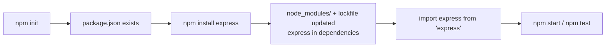

# 02 - npm, modules, and package.json

## The one-sentence answer

**npm is how you install and manage the code your project depends on, and
`package.json` is the file that records what your project is and what it needs.**
Modules are how you split your own code into files that import each other.

## Modules: splitting code across files

A **module** is just a file that exposes some of its values (`export`) so other
files can use them (`import`). Instead of one giant file, you write small focused
ones and wire them together. You already did this in React.

There are **two module systems** in the Node world, and you will meet both:

### ES Modules (ESM) - the modern default, and what we use

```js
// haunt.js
export function slugify(place) { /* ... */ }
export const LEVELS = 5

// app.js
import { slugify, LEVELS } from './haunt.js'
```

You opt in by setting `"type": "module"` in `package.json` (or using an `.mjs`
extension). Note the **`.js` extension is required** in the import path in Node
ESM. This is the same `import`/`export` syntax as React.

### CommonJS (CJS) - the older style you will still see

```js
// haunt.js
function slugify(place) { /* ... */ }
module.exports = { slugify }

// app.js
const { slugify } = require('./haunt.js')
```

Tons of existing Node code and tutorials use `require`/`module.exports`. Know how
to read it, but **write ESM** in this course.

| | ESM (`import`) | CommonJS (`require`) |
| --- | --- | --- |
| Enabled by | `"type": "module"` | the Node default (no setting) |
| Syntax | `import` / `export` | `require` / `module.exports` |
| Same as your React code | yes | no |

## Built-in vs your own vs installed modules

An `import` can point at three kinds of thing:

```js
import { readFile } from 'node:fs/promises' // 1. built into Node (note node: prefix)
import express from 'express'               // 2. installed from npm (a package)
import { slugify } from './haunt.js'        // 3. your own file (relative path)
```

## npm: the package manager

**npm** (Node Package Manager) installs **packages** - reusable libraries other
people published - from the public **npm registry**. Express, Vitest, and `pg`
are all packages.

```bash
npm install express        # add a runtime dependency
npm install -D vitest      # add a dev-only dependency (-D = --save-dev)
npm install                # install everything package.json lists
npm ci                     # clean install exactly what the lockfile pins (CI uses this)
```

- **`dependencies`** are needed to *run* the app (Express, `pg`).
- **`devDependencies`** are needed only to *develop/test* it (Vitest, supertest,
  pg-mem). They are not shipped to production.

Installed code lands in **`node_modules/`** (never committed - it is huge and
rebuildable) and is recorded in **`package-lock.json`** (always committed - it
pins exact versions so everyone gets an identical install).

## package.json: the project's ID card

Every Node project has one. It names the project, lists dependencies, and defines
**scripts** - named shortcuts you run with `npm run <name>`.

```json
{
  "name": "haunted-sightings",
  "version": "1.0.0",
  "type": "module",
  "scripts": {
    "start": "node app.js",
    "test": "vitest run"
  },
  "dependencies": {
    "express": "^4.19.0"
  },
  "devDependencies": {
    "vitest": "^2.0.0"
  }
}
```

- **`scripts.test`** is special: `npm test` runs it (no `run` needed). This is
  exactly what the autograder calls.
- **`"type": "module"`** turns on ESM for the whole project.

### Semver: what `^4.19.0` means

Versions are **MAJOR.MINOR.PATCH** (semantic versioning). The **caret** `^`
means "this version or any newer one that does not change the major number" - so
`^4.19.0` accepts `4.20.0` but not `5.0.0`. Major bumps signal breaking changes;
the lockfile is what guarantees a repeatable install regardless.

## The flow, start to finish



## In one breath, for the exam

> A **module** is a file that `export`s values for other files to `import`; Node
> supports **ES Modules** (`import`, enabled by `"type":"module"`) and older
> **CommonJS** (`require`). **npm** installs **packages** from the registry into
> **`node_modules/`**, recording runtime **`dependencies`** and
> **`devDependencies`** in **`package.json`** and exact versions in
> **`package-lock.json`**. `package.json` also defines **scripts** like
> `npm test`. **Semver** (`^4.19.0`) controls which updates are allowed.

## References

- npm Docs. *About npm*. https://docs.npmjs.com/about-npm
- npm Docs. *package.json*. https://docs.npmjs.com/cli/v10/configuring-npm/package-json
- Node.js Documentation. *Modules: ECMAScript modules*. https://nodejs.org/api/esm.html
- Node.js Documentation. *An introduction to the npm package manager*. https://nodejs.org/en/learn/getting-started/an-introduction-to-the-npm-package-manager
- Semantic Versioning. *semver.org*. https://semver.org/
