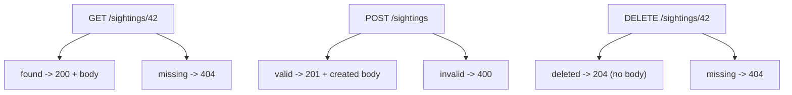

# 05 - RESTful design patterns

> This is the theory-heavy one. REST is less about code and more about a set of
> conventions everyone agrees on, so that any client can guess how your API
> works. Read it slowly - it is the backbone of Module 4 and 5.

## The one-sentence answer

**REST is a style for designing web APIs around *resources* (nouns) that you act
on with standard HTTP *verbs*.** Follow its conventions and your API becomes
predictable: anyone who knows REST can use it without a manual.

## What REST is

REST (Representational State Transfer) is an **architectural style**, not a
library or a standard you install. An API that follows it is called **RESTful**.
The core idea: model your domain as **resources**, give each a **URL**, and use
the **HTTP method** to say what you want to do to it.

A **resource** is a thing your app knows about - a sighting, a user, an order. In
our app the resource is `sightings`, and each individual one lives at its own
address.

## Resources are nouns; methods are verbs

The single most common REST mistake is putting the verb in the URL. Don't:

| Bad (verb in URL) | Good (noun URL + HTTP verb) |
| --- | --- |
| `GET /getSightings` | `GET /sightings` |
| `POST /createSighting` | `POST /sightings` |
| `GET /deleteSighting?id=42` | `DELETE /sightings/42` |

The URL names the **thing**; the **method** says the **action**. Two levels of
URL cover almost everything:

- **`/sightings`** - the whole **collection**
- **`/sightings/:id`** - one **member** of it

## The standard verbs and what they mean

| Method | On `/sightings` (collection) | On `/sightings/:id` (one) | Meaning |
| --- | --- | --- | --- |
| **GET** | list all | fetch that one | read, never changes data |
| **POST** | create a new one | - | create |
| **PUT** | - | replace that one fully | full update |
| **PATCH** | - | change some fields | partial update |
| **DELETE** | - | remove that one | delete |

This is the CRUD mapping (**C**reate/**R**ead/**U**pdate/**D**elete) you will
implement in m4a3 and persist in m5:

```
Create -> POST   /sightings
Read   -> GET    /sightings   and   GET /sightings/:id
Update -> PUT/PATCH /sightings/:id
Delete -> DELETE /sightings/:id
```

## Status codes: say what happened

The response **status code** tells the client the outcome. Using the right one is
part of being RESTful. The families:

- **2xx success** - **200** OK (a good GET/PATCH), **201** Created (a good POST -
  and return the new resource), **204** No Content (a good DELETE - empty body).
- **4xx client error** - **400** Bad Request (invalid input), **404** Not Found
  (no such resource), **401**/**403** (not authenticated / not allowed).
- **5xx server error** - **500** Internal Server Error (your code threw).

The rule of thumb for CRUD:



Returning **200 for everything** (even errors) is a classic anti-pattern - the
client can't tell success from failure without parsing the body.

## Safe and idempotent (a favorite exam pair)

- **Safe** = does not change data. **GET** is safe; you can call it a hundred
  times and nothing changes on the server.
- **Idempotent** = calling it once or many times leaves the same result.
  **GET, PUT, DELETE** are idempotent (deleting #42 twice - the second is still
  "gone"). **POST is not**: two POSTs create **two** resources.

| Method | Safe? | Idempotent? |
| --- | --- | --- |
| GET | yes | yes |
| POST | no | no |
| PUT | no | yes |
| PATCH | no | not necessarily |
| DELETE | no | yes |

## Statelessness

REST is **stateless**: **each request carries everything the server needs to
handle it** (who you are, what you want). The server keeps **no memory** of your
previous requests between calls. This is why REST scales - any server instance
can handle any request, and you can add more servers freely. (Data still lives in
the database; "stateless" means no per-client *session* memory held on the server
between requests.)

## Good URL design, briefly

- **Nouns, plural**: `/sightings`, not `/sighting` or `/getSighting`.
- **Hierarchy for relationships**: `/sightings/42/comments` (the comments of
  sighting 42).
- **Filtering/sorting/paging via the query string**, not new paths:
  `GET /sightings?place=library&sort=spookiness`.
- **Lowercase, hyphenated** if multiword: `/ghost-sightings`.

## Representations: JSON

A resource can be *represented* in different formats; modern APIs use **JSON**.
The client says what it wants with the `Accept` header and what it is sending
with `Content-Type: application/json`. In Express, `express.json()` reads the
incoming JSON and `res.json()` sends it back.

## In one breath, for the exam

> **REST** models a domain as **resources** with noun URLs (`/sightings`,
> `/sightings/:id`) and acts on them with HTTP **verbs** (GET read, POST create,
> PUT/PATCH update, DELETE remove = CRUD). It returns meaningful **status codes**
> (200, 201, 204, 400, 404, 500). **GET is safe**; **GET/PUT/DELETE are
> idempotent**, **POST is not**. It is **stateless** - every request is
> self-contained - and it exchanges **JSON** representations.

## References

- MDN Web Docs. *HTTP request methods*. https://developer.mozilla.org/en-US/docs/Web/HTTP/Methods
- MDN Web Docs. *HTTP response status codes*. https://developer.mozilla.org/en-US/docs/Web/HTTP/Status
- MDN Web Docs. *An overview of HTTP (stateless)*. https://developer.mozilla.org/en-US/docs/Web/HTTP/Overview
- Fielding, R. T. *Architectural Styles and the Design of Network-based Software Architectures* (the REST dissertation), ch. 5. https://ics.uci.edu/~fielding/pubs/dissertation/rest_arch_style.htm
- Microsoft. *RESTful web API design best practices*. https://learn.microsoft.com/en-us/azure/architecture/best-practices/api-design
