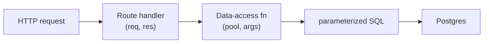

# 04 - CRUD with PostgreSQL

## The one-sentence answer

**CRUD is the four operations - Create, Read, Update, Delete - and this doc shows
each one as a parameterized `pg` call, then wires them to REST routes.** This is
the pattern you implement in m5a2 (the data-access layer) and m5a3 (the API on
top of it).

## The one table

Everything starts from a schema. Create it once (m5a1 does exactly this):

```sql
CREATE TABLE IF NOT EXISTS sightings (
  id          SERIAL PRIMARY KEY,          -- auto-incrementing id
  place       TEXT NOT NULL,
  description TEXT,
  spookiness  INTEGER NOT NULL,
  reported_at TIMESTAMPTZ DEFAULT now()
);
```

- **`SERIAL PRIMARY KEY`** gives each row an auto-generated unique `id`, so you
  never set it yourself.
- **`NOT NULL`** forces a value; **`DEFAULT now()`** fills the timestamp for you.

## The four operations, each parameterized

Assume a connected `pool` (or an injected client). Every value goes through
`$n` + a values array - never string concatenation (see doc 03).

### Create (POST)

```js
async function create(pool, { place, description, spookiness }) {
  const result = await pool.query(
    `INSERT INTO sightings (place, description, spookiness)
     VALUES ($1, $2, $3)
     RETURNING *`,
    [place, description, spookiness]
  )
  return result.rows[0] // the new row, with its generated id
}
```

### Read (GET) - all and one

```js
async function getAll(pool) {
  const result = await pool.query('SELECT * FROM sightings ORDER BY id')
  return result.rows            // array (possibly empty)
}

async function getById(pool, id) {
  const result = await pool.query('SELECT * FROM sightings WHERE id = $1', [id])
  return result.rows[0] ?? null // one row, or null if not found
}
```

Returning **`null` when nothing matched** is the signal your route uses to send a
**404**.

### Update (PATCH/PUT)

```js
async function update(pool, id, { place, description, spookiness }) {
  const result = await pool.query(
    `UPDATE sightings
     SET place = $1, description = $2, spookiness = $3
     WHERE id = $4
     RETURNING *`,
    [place, description, spookiness, id]
  )
  return result.rows[0] ?? null // updated row, or null if that id did not exist
}
```

### Delete (DELETE)

```js
async function remove(pool, id) {
  const result = await pool.query(
    'DELETE FROM sightings WHERE id = $1 RETURNING id',
    [id]
  )
  return result.rows.length > 0 // true if a row was actually deleted
}
```

Note the **`WHERE id = $n`** on update and delete - without it you would change or
wipe **every** row.

## Mapping CRUD to the REST routes

This is how m5a3 connects the two halves of the midterm. The route handles HTTP;
the data-access function handles SQL:

```js
app.get('/sightings', async (req, res) => {
  res.json(await getAll(pool))
})

app.get('/sightings/:id', async (req, res) => {
  const one = await getById(pool, req.params.id)
  if (!one) return res.status(404).json({ error: 'Not found' })
  res.json(one)
})

app.post('/sightings', async (req, res) => {
  const created = await create(pool, req.body)
  res.status(201).json(created)
})

app.delete('/sightings/:id', async (req, res) => {
  const ok = await remove(pool, req.params.id)
  res.status(ok ? 204 : 404).end()
})
```

Notice the **layering**: routes never write SQL, and data-access functions never
touch `req`/`res`. Keeping those separate is what the m5a3 rubric calls "clean
separation of routes and data access," and it makes both testable.



## A note on transactions (for later)

When several writes must all succeed or all fail together (transfer money, place
an order that reduces stock), you wrap them in a **transaction**: `BEGIN`, your
statements, then `COMMIT` (or `ROLLBACK` on error). You will not need this for the
midterm's single-table CRUD, but it is the next idea to learn after this module.

## In one breath, for the exam

> **CRUD** on Postgres is **INSERT/SELECT/UPDATE/DELETE**, each written as a
> **parameterized** `pool.query`, with **`RETURNING *`** to get the affected row
> and **`WHERE id = $n`** to target one. A **not-found** read/update returns
> `null` so the route can send **404**. Good design **layers** it: routes do HTTP,
> data-access functions do SQL, and the two never mix. Multi-step writes use a
> **transaction** (`BEGIN`/`COMMIT`/`ROLLBACK`).

## References

- PostgreSQL Documentation. *INSERT*, *SELECT*, *UPDATE*, *DELETE*. https://www.postgresql.org/docs/current/sql-commands.html
- node-postgres Documentation. *Queries* (result object, `rows`). https://node-postgres.com/features/queries
- PostgreSQL Documentation. *Data Definition - Constraints*. https://www.postgresql.org/docs/current/ddl-constraints.html
- PostgreSQL Documentation. *Transactions*. https://www.postgresql.org/docs/current/tutorial-transactions.html
- MDN Web Docs. *HTTP response status codes* (200/201/204/404). https://developer.mozilla.org/en-US/docs/Web/HTTP/Status
